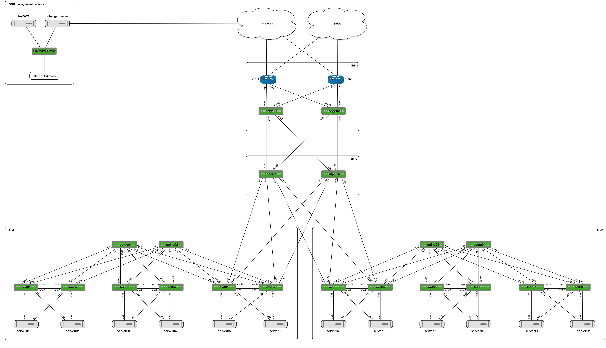

# Cumulus Putting It All Together demo

This demo will install Cumulus Linux (VX) in a 2-pod topology that was made with the [topology converter](https://github.com/CumulusNetworks/topology_converter). This demo puts several technologies together to demo a complete deployment:

* EVPN L2VNIs
* EVPN L3VNIs
  * IPv4 Type-5
  * IPv6 Type-5
* Cumulus NetQ
* VRF setup on Ubuntu 16.04 with Ifupdown2
* Netbox IPAM & automated provisioning of the Ansible inventory
* Grafana for graphs from the NetQ interface statistics
* CI/CD with Gitlab
* Custom Ansible Jinja templates to deploy the above





Table of Contents
=================
* [Prerequisites](#prerequisites)
* [Using Libvirt KVM](#using-libvirtkvm)
* [Using Virtualbox](#using-virtualbox)
* [Using Cumulus in the Cloud](#using-cumulus-in-the-cloud)
* [Demo explanation](#Demo explanation)
  * [Tenant setup](#Tenant setup)
  * [Orchestration](#Automation)
  * [Orchestration](#Orchestration)
* [Running the Demo](#running-the-demo)
  * [EVPN](#EVPN)
  * [NetQ](#NetQ)
  * [Grafana](#Grafana)
  * [Netbox](#Netbox)
  * [CI/CD](#CI/CD)
* [Troubleshooting + FAQ](#troubleshooting--faq)


Prerequisites
------------------------
* Running this simulation roughly 23G of Ram (by default only pod1, superspines and edge are started. Full topology will use ~35G)
* Internet connectivity is required from the hypervisor. Multiple packages are installed on both the switches and servers when the lab is created.
* Download this repository locally with `git clone` 
* Download the NetQ Telemetry Server from https://cumulusnetworks.com/downloads/#product=NetQ%20Virtual&hypervisor=Vagrant. You need to be logged into the site to access this.  Choose NetQ 1.3.
* Setup your hypervisor according to the instructions with [Vagrant, Libvirt and KVM](https://docs.cumulusnetworks.com/display/VX/Vagrant+and+Libvirt+with+KVM+or+QEMU)

Using Libvirt+KVM
------------------------
* Install the Vagrant mutate plugin with 
`vagrant plugin install vagrant-mutate`
* Convert the existing NetQ telemetry server box image to a libvirt compatible version.   
`vagrant mutate cumulus-netq-telemetry-server-amd64-1.3.0-vagrant.box libvirt`
* Rename the new Vagrant box image by changing the Vagrant directory name.  
`mv $HOME/.vagrant.d/boxes/cumulus-netq-telemetry-server-amd64-1.3.0-vagrant/ $HOME/.vagrant.d/boxes/cumulus-VAGRANTSLASH-ts`
* Start the topology with the script `./evpn-symmetric-edge.sh`. This will run the vagrant commands to start the topology. By default only pod1, superspines and edge devices are started. This should provide sufficient devices for most demos, but the topology would give the possibility to run the demo on a larger environment. 

Next, when fully booted:
* Enter the environment by running `vagrant ssh oob-mgmt-server` from the vx-topology directory. On the oob-server, the same git repository is cloned that hold the necessary Ansible playbooks. Start provisioning the environment by running `./provision.sh` from the `cl-piat/automation` directory. This will run an ansible playbook that provisions the network devicees and servers. Running the full playbook when the topology isn't provisioned yet, can take several minutes, because several software packages have to be installed (be patient).

Using Virtualbox
------------------------
The topology can be generated for Virtualbox, but given the requirements it will not run on on typical desktops/laptops. Recommentation is to use the demo with the Libvirt/KVM. If Virtualbox is necessary, create an issue and we can create a Virtualbox Vagrantfile.  


Using Cumulus in the Cloud
------------------------
Request a "Blank Workbench" on [Cumulus in the Cloud](https://cumulusnetworks.com/try-for-free/). When you receive notice that it is provisioned, connect to the *oob-mgmt-server*

Once connected run  
`git clone`

Because the CITC workbench is a subset of the above topology (2 spines, 4 leafs, 4 servers), we have to change the hosts file to provision less hosts. There is a specific hosts file provided in the `demo` directory. 

Next  
`cd cl-piat/automation`  
`mv ../demo/citc/hosts .`
`./provision.sh`

Demo explanation
------------------------

### Tenant setup
### Orchestration


Running the Demo
------------------------

### EVPN
### NetQ
### Grafana
### Netbox
### CI/CD


Troubleshooting + FAQ
-------
* The `Vagrantfile` expects the telemetry server to be named `cumulus/ts`. If you get the following error
```The box 'cumulus/ts' could not be found or could not be accessed in the remote catalog. If this is a private box on HashiCorp's Atlas, please verify you're logged in via `vagrant login`. Also, please double-check the name. The expanded URL and error message are shown below:

URL: ["https://atlas.hashicorp.com/cumulus/ts"]
Error: The requested URL returned error: 404 Not Found
```

Please ensure you have the telemetry server downloaded and installed in Vagrant. Use `vagrant box list` to see the current Vagrant box images you have installed.
* `vagrant ssh` fails to network devices - This is expected, as each network device connects through the `oob-mgmt-server`. Use `vagrant ssh oob-mgmt-server` then ssh to the specific network device.
* If you log into a switch and are prompted for the password for the `vagrant` user, issue the command `su - cumulus` to change to the cumulus user on the oob-mgmt-server
